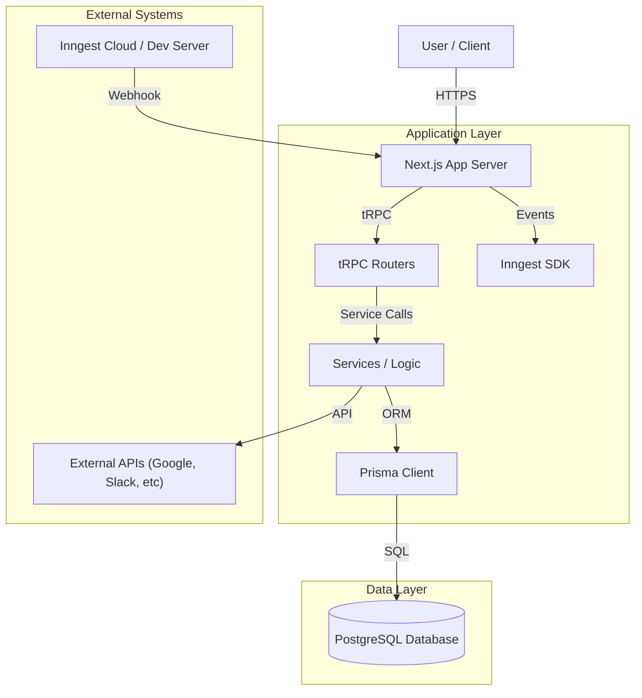

# NodeBase System Design

## 1. Overview
NodeBase is a workflow automation platform built with modern web technologies. It allows users to create, visualize, and execute automated workflows connecting various services (like Google, Slack, Discord, OpenAI/Gemini) through a node-based interface.

## 2. Architecture

The system follows a monolithic architecture built on the ** Next.js** framework, serving both the frontend (React server/client components) and the backend API (tRPC). Background job processing and reliable workflow execution are handled by **Inngest**.

## 3. Technology Stack

-   **Framework**: [Next.js](https://nextjs.org/) (App Router, React Server Components)
-   **Language**: TypeScript
-   **Database ORM**: [Prisma](https://www.prisma.io/)
-   **Database**: PostgreSQL
-   **API Layer**: [tRPC](https://trpc.io/)
-   **Authentication**: [Better Auth](https://better-auth.com/) / NextAuth patterns
-   **Styling**: Tailwind CSS, Shadcn UI
-   **State Management**: React Query (TanStack Query), Jotai (likely for client-side editor state)
-   **Workflow Engine**: [Inngest](https://www.inngest.com/)
-   **Validation**: Zod
-   **Tooling**: Biome (Linter/Formatter)

## 4. Data Model

The core data model revolves around Users, Workflows, and Executions.

### Core Entities
-   **User**: Accounts with authentication details.
-   **Workflow**: The main unit of automation. Owned by a User. Contains Nodes and Connections.
-   **Node**: A step in the workflow (e.g., "Manual Trigger", "Send Slack Message", "Ask Gemini"). Stores configuration `data` as JSON.
-   **Connection**: Links between nodes defining the flow of execution.
-   **Execution**: A record of a workflow run. Tracks status (`RUNNING`, `SUCCESS`, `FAILED`), output, and errors. Linked to an Inngest event ID.
-   **Credential**: Stores sensitive information (API keys) for services, linked to Users and Nodes.
-   **Session / Account / Verification**: Authentication support tables.

## 5. Key Components

### 5.1 Workflow Editor
A visual, node-based editor (likely using React Flow or similar under the hood) allowing users to drag and drop nodes, configure them, and connect outputs to inputs.
-   **Location**: `src/features/editor` (inferred)
-   **Functionality**:
    -   Add/Remove Nodes
    -   Connect Nodes
    -   Configure Node properties (inputs, API keys)

### 5.2 Execution Engine
The backend logic that interprets the workflow graph and runs it.
-   **Triggering**: Workflows start via triggers (Webhooks, Schedules, Manual clicks).
-   **Processing**:
    -   **Inngest** is used to orchestrate steps reliably.
    -   Each node execution is likely a step in an Inngest function.
    -   State is passed between steps.
-   **Monitoring**: Execution logs are stored in the database for debugging.
    
### 5.3 Triggers & Actions
-   **Triggers**:
    -   `MANUAL_TRIGGER`: Button click in UI.
    -   `HTTP_REQUEST`: Incoming webhook (TODO/In-progress).
    -   `GOOGLE_FORM_TRIGGER`, `STRIPE_TRIGGER`: External event hooks.
-   **Actions**:
    -   `GEMINI`: AI processing.
    -   `DISCORD`, `SLACK`: Messaging integrations.

## 6. Directory Structure (Key Areas)

-   `src/app`: Next.js App Router pages and API routes.
-   `src/components`: Reusable UI components.
-   `src/features`: Domain-specific logic (e.g., editor, workflows).
-   `src/server` / `src/trpc`: Backend API definition.
-   `src/inngest`: Background function definitions.
-   `prisma/schema.prisma`: Database schema.

## 7. Security Considerations
-   **Authentication**: Secure session management via Better Auth.
-   **Credentials**: API keys for third-party services should be stored securely (encryption recommended if not already implemented).
-   **API Security**: tRPC endpoints protected by middleware ensuring user ownership of resources.
